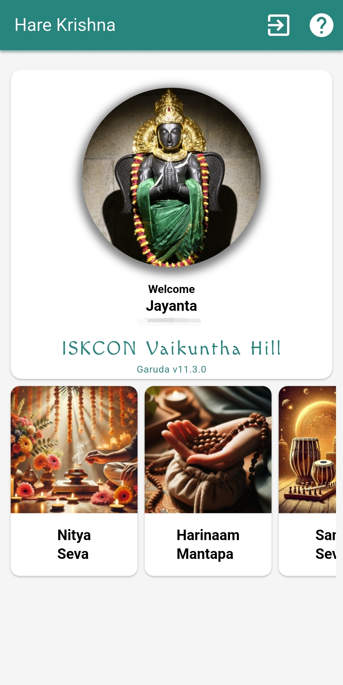
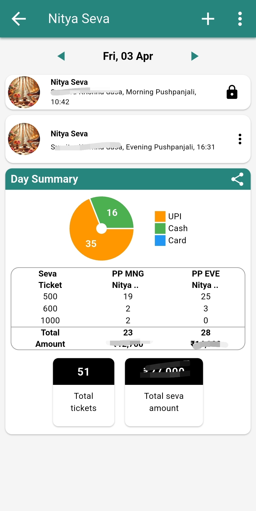
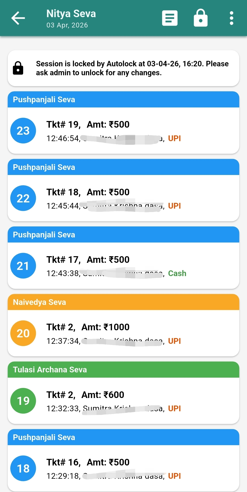
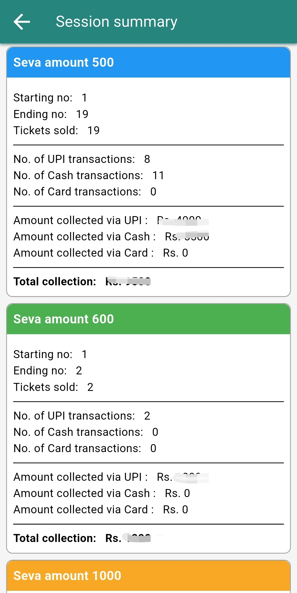
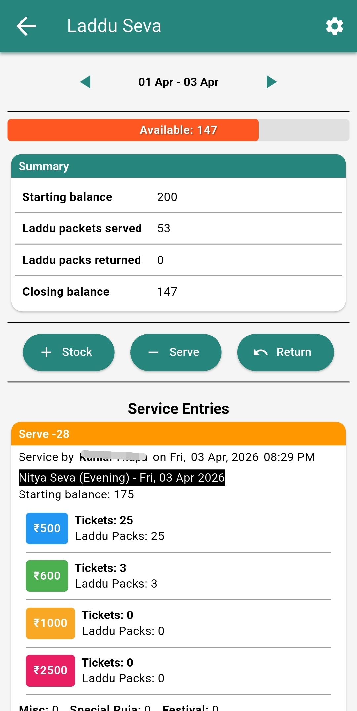
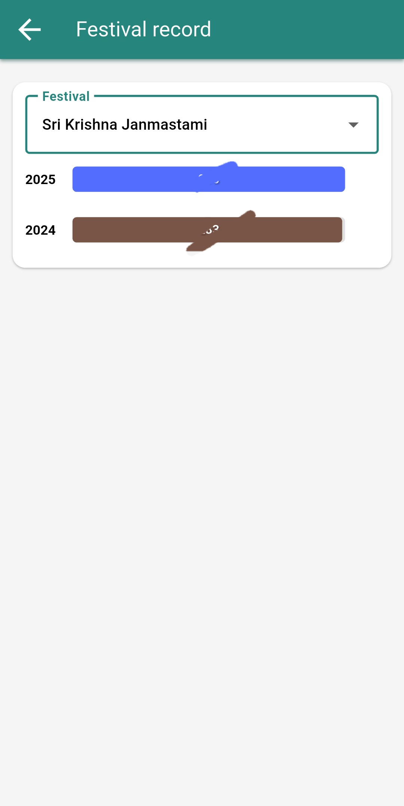
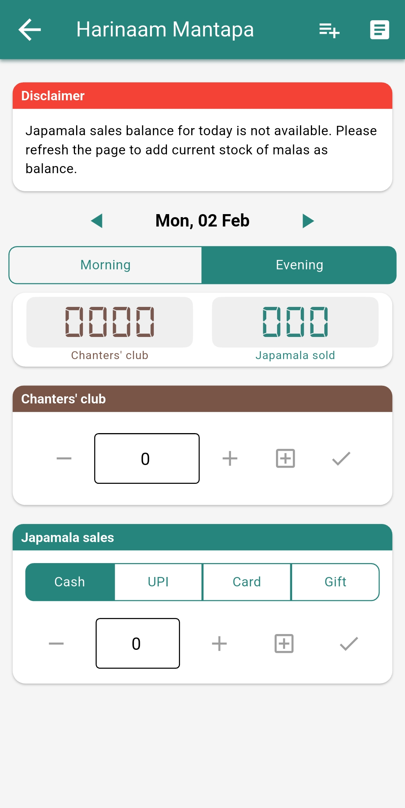
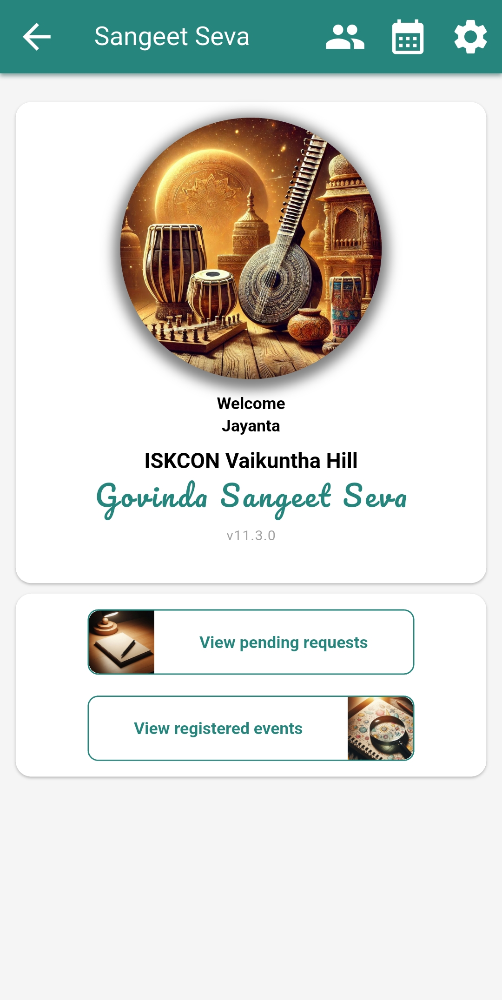
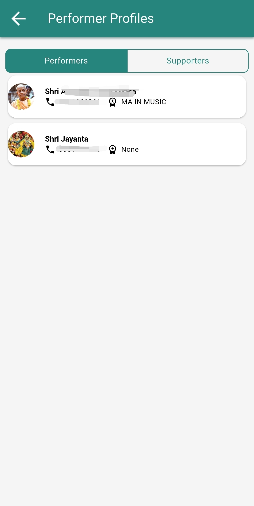
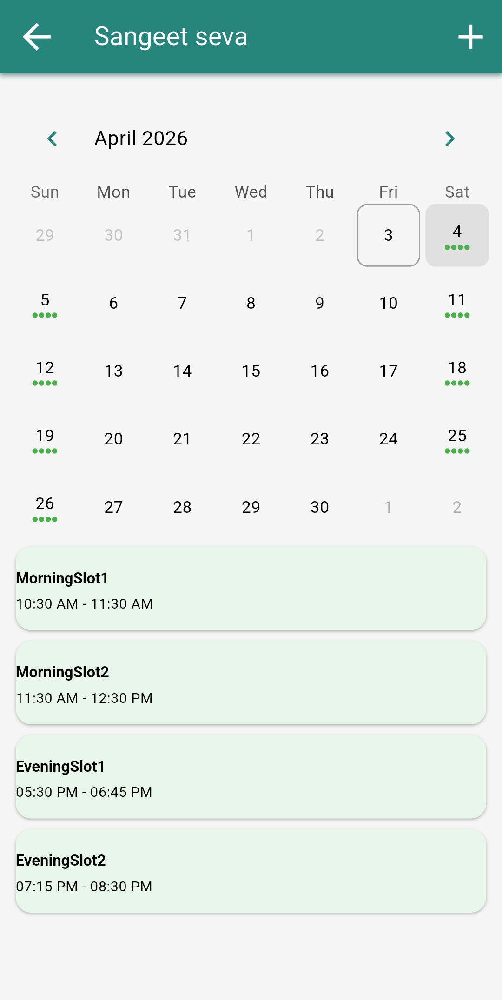

# vkhillseva
Seva App for ISKCON Vaikuntha Hill

> **Disclaimer:** `main` branch is not maintained anymore. Please go to desired release branches to see the latest changes.

## Apps

| App | Description |
|-----|-------------|
| `vkhgaruda` | Garuda - the main seva management app |
| `vkhsangeetseva` | SangeetSeva - the music seva app |

## Screenshots

<!-- Horizontally scrolling gallery -->
<div style="overflow-x: auto; display: flex; gap: 12px; padding: 16px 0; scrollbar-width: thin;">
  
  
  
  
  
  
  
  
  
  
</div>

## Pre-requisites
- Flutter SDK (3.6.0 or higher)
- Python 3.x (for build scripts)
- Firebase account with configured project
- Firebase CLI (`firebase`)
- FlutterFire CLI (`flutterfire`)

## Setup

### 1. Clone the Repository
```bash
git clone https://github.com/jayantadn/vkhillseva.git
cd vkhillseva
```

Add the secrets:
1. `google-services.json` in each app's `android/app/` folder
2. `garuda-1ba07-firebase-adminsdk-fbsvc-c07e3d6e0a.json` in root folder 

Generate Firebase Dart config files (not committed to git):

```bash
# Install CLI tools once (if not already installed)
sudo npm install -g firebase-tools
dart pub global activate flutterfire_cli

# Garuda
cd vkhgaruda
flutterfire configure --project=garuda-1ba07 --platforms=android,web --out=lib/firebase_options.dart

# SangeetSeva
cd ../vkhsangeetseva
flutterfire configure --project=garuda-1ba07 --platforms=android,web --out=lib/firebase_options.dart
```

If `flutterfire` is not found, ensure Dart pub global binaries are in your PATH.

### 2. Configure Android signing (release builds)

Create `key.properties` in each app's `android/` folder:

`vkhgaruda/android/key.properties`
`vkhsangeetseva/android/key.properties`

```
storePassword=your_store_password
keyPassword=your_key_password
keyAlias=your_key_alias
storeFile=path/to/your/keystore.jks
```

`key.properties` is already excluded from git via `.gitignore`.

### 3. Install Dependencies

```bash
cd vkhgaruda && flutter pub get && cd ..
cd vkhsangeetseva && flutter pub get
```

## Run and Build

### Local development

```bash
# Garuda
cd vkhgaruda
flutter run

# SangeetSeva
cd ../vkhsangeetseva
flutter run
```

### Web builds

```bash
# Garuda
cd vkhgaruda
flutter build web

# SangeetSeva
cd ../vkhsangeetseva
flutter build web
```

### Android APK (release)

```bash
# Garuda
cd vkhgaruda
flutter build apk --release

# SangeetSeva
cd ../vkhsangeetseva
flutter build apk --release
```

APK output path:

`build/app/outputs/flutter-apk/app-release.apk`

## Production Release (Using Release Script)

```bash
# From the root directory
python 02_release.py
```

When prompted:
- Enter `1` for Release build
- Enter `2` for Test build

The release script will:
1. ✓ Update changelog from git commits
2. ✓ Build web and Android versions
3. ✓ Deploy to Firebase Hosting (if configured)

## Security Notes

### Protected Files (Never Commit These):
- ✓ `key.properties` (contains signing keys)
- ✓ `.timetracker` (personal time tracking data)

These files are automatically ignored by `.gitignore`

## Firebase Security Checklist

Before going public, ensure:
- [ ] Firebase Realtime Database Rules are configured (not in public read/write mode)
- [ ] Firebase Storage Rules are configured
- [ ] Firebase Authentication is properly set up
- [ ] API keys are restricted in Google Cloud Console
- [ ] Add your website domain to allowed domains
- [ ] Add your Android app SHA-1 fingerprint
- [ ] Enable Firebase App Check for web and mobile
- [ ] Review all Firebase project IAM permissions

## License

See [LICENSE](LICENSE) file for details.

